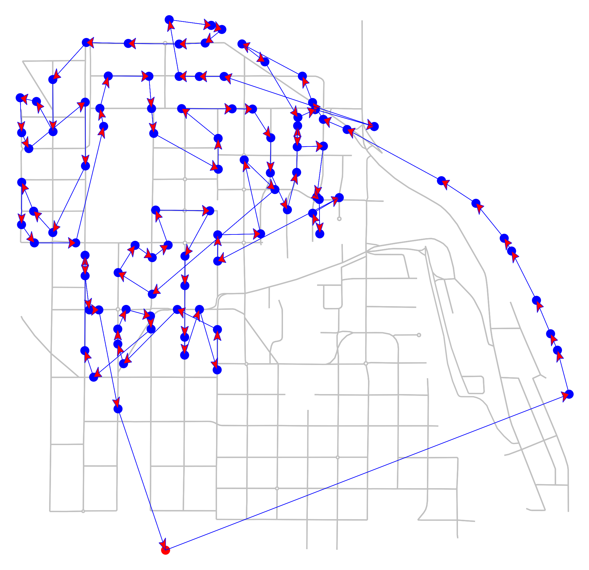

# AWS Last Mile Route Optimization

This is our solution to the [Amazon Last Mile Routing Research Challenge](https://routingchallenge.mit.edu/). The solution runs as an Amazon SageMaker Processing Job, and is based on our paper **[Learning from Drivers to Tackle the Amazon Last Mile Routing Research Challenge](https://arxiv.org/)**. The diagram below shows an overview of our method. Our solution hierarchically integrates [Markov model](https://en.wikipedia.org/wiki/Markov_model) training, online policy search (i.e. [Rollout](https://www.amazon.com/dp/1886529078/)), and a conventional [Traveling Salesperson Problem](https://en.wikipedia.org/wiki/Travelling_salesman_problem) (TSP) solver to produce driver friendly routes during last mile planning. The choice of the underlying TSP solver is flexible. For example, our paper reported the evaluation score of 0.0374 using [LKH](http://akira.ruc.dk/~keld/research/LKH/). This Git repository uses [OR-tools](https://github.com/google/or-tools) for simplicity, and obtains a nearly identical score of 0.0372. These results are comparable to what the top three teams have achieved on the public [leaderboard](https://routingchallenge.mit.edu/last-mile-routing-challenge-team-performance-and-leaderboard/).

The example below shows the 110-stop route sequence produced by our method on the left (*driver friendly*) and by conventional TSP solvers on the right (*cost-optimal*). While the cost optimal route has less travelling time in theory, its 2D plot shows a narrow and sharp V shape that connects stops from and back to the depo (the red circle at the bottom). This may lead the drivers to the misperception that the cost optimal route forces them to reverse course, which is unpleasant to execute in practice.
| Driver friendly sequence             |  Time optimal sequence |
:-------------------------:|:-------------------------:
  |  
travel time: 2.01 hours | travel time: 1.80 hours

# Method Overview


Our method includes the training phase and the inference phase. The training phase produces a [Prediction by Partial Matching](https://en.wikipedia.org/wiki/Prediction_by_partial_matching) (PPM for short) model to extract sequential patterns from Travelling *Zones*. These patterns encode driver preferences and behaviour, and are important to produce driver friendly routes for future package deliveries. During the inference phase, **Step 1** - the trained PPM model auto-regressively generates new zone sequences guided by the [Rollout method](http://lidstheme.mit.edu/publications/rollout-algorithms-combinatorial-optimization). **Step 2** - for each zone in the generated zone sequence, we use [OR-tools](https://github.com/google/or-tools) to solve a small TSP instance to produce *Stop* (namely, package delivery) sequence. **Step 3** - we join stop sequences from all zones as per the zone sequence order to form the *global* stop sequence as the final solution. The following Python code snippet summarises the main idea of our method.
```python
# Training
ppm_model = train_ppm_model(ground_truth)
# Inference
for route in all_routes:
    all_stops = []
    zone_set = get_zone_set(route) # Step 0
    sorted_zones = ppm_rollout_sort_zone(zone_set, ppm_model) # Step 1
    for zone in sorted_zones:
        sorted_stops = LKH(zone)   # Step 2
        all_stops += sorted_stops  # Step 3
```

# Quick Start
The Quick Start instructions below are based on `macOS` and `Linux` OS with [AWS CLI installed](https://docs.aws.amazon.com/cli/latest/userguide/getting-started-install.html).

## Step 1. Install
```bash
# Get the source code
git clone https://github.com/aws-samples/amazon-sagemaker-amazon-routing-challenge-sol.git
cd amazon-sagemaker-amazon-routing-challenge-sol

# Setup Python Environment
conda create --name aro python=3.8
conda activate aro # `aro` is the name of the python virtual environment, feel free to change it
# if on a SageMaker notebook instance, uncomment and execute the following command instead
# source activate aro

# Install the current version of the package
pip install -r requirements_dev.txt
pip install -e .
```

## Step 2. Obtain data
More specific instructions will be provided here once the dataset associated with the [Amazon Last Mile Routing Research Challenge](https://routingchallenge.mit.edu/) is made publicly avaialble at [Open Data on AWS](https://registry.opendata.aws/). 
The following code snippets assume you have downloaded the `train` and `evaluation` datasets to your local machine at `/tmp/Final_March_15_Data` and `/tmp/Final_June_18_Data` respectively.

## Step 3. Preprocess data
The datasets contain package (aka *stop* ) information, such as destination locations, parcel specifications, customer preferred time windows, expected service times, and zone identifiers. The preprocesing step converts this information from JSON to [Parquet](https://parquet.apache.org/) and [Numpy array format](https://numpy.org/doc/stable/reference/generated/numpy.lib.format.html) for easy access.
```bash
train_data_dir=Final_March_15_Data
eval_data_dir=Final_June_18_Data
mkdir data
# please replace the example source directory `/tmp` with actual path for downloaded datasets
mv /tmp/${train_data_dir} data/
mv /tmp/${eval_data_dir} data/

# generate package information in Parquet (training)
python preprocessing.py --act gen_route --data_dir  data/${train_data_dir}

# generate travel time matrix that contains pair-wise travel time for all stops in a given route (training)
python preprocessing.py --act gen_dist_mat --data_dir  data/${train_data_dir}

# generate zone information for each stop (training)
python preprocessing.py --act gen_zone_list --data_dir  data/${train_data_dir}

# generate ground-truth zone sequence for each route
python preprocessing.py --act gen_actual_zone --data_dir  data/${train_data_dir}

# generate package information in Parquet (evaluation)
python preprocessing.py --act gen_route --data_dir  data/${eval_data_dir}

# generate travel time matrix that contains pair-wise travel time for all stops in a given route (evaluation)
python preprocessing.py --act gen_dist_mat --data_dir  data/${eval_data_dir}

# generate zone information for each stop (evaluation)
python preprocessing.py --act gen_zone_list --data_dir  data/${eval_data_dir}
```

## Step 4. Upload pre-processed data to S3
We upload pre-processed data to Amazon S3 in order to run SageMaker processing jobs during the inference phase.
```bash
export bucket_name=my-route-bucket # set `${bucket_name}` to your own S3 bucket name
export s3_data_prefix=lmc # set `${s3_data_prefix}` to your own S3 data prefix
aws s3 sync data/${train_data_dir}/ s3://${bucket_name}/data/${s3_data_prefix}/${train_data_dir}/
aws s3 sync data/${eval_data_dir}/ s3://${bucket_name}/data/${s3_data_prefix}/${eval_data_dir}/
```
After completing this step, the prefix structure in your S3 bucket appears as follows:
``` bash
${train_or_eval_data_dir}                # e.g. `Final_March_15_Data` OR `Final_June_18_Data`
├── distance_matrix/                     # a directory with all distance matrix files
│   ├── ${route_id_0}_raw_w_st.npy       # distance matrix file produced by preprocessing.py 
│   ├── ...                              # more distance matrix files
│   └── ${route_id_N}_raw_w_st.npy       # distance matrix file
├── model_apply_inputs/                  # challenge input files
├── model_apply_outputs/                 # output json results here
├── model_build_inputs/                  # challenge input files
├── model_score_inputs/                  # challenge input files
├── model_score_outputs/                 # output json score here
├── processed/                           # output processed parquet file here
└── zone_list                            # A directory with all zone files
    ├── ${route_id_0}_zone_w_st.joblib   # zone file produced by preprocessing.py            
    ├── ...                              # more zone files
    ├── ${route_id_N}_zone_w_st.joblib   # the last zone file
    └── actual_zone-{mode}.csv           # ground-truth zone sequence file produced 
                                         # by preprocessing.py
```

## Step 5. Train the PPM model locally
We train the [Prediction by Partial Matching (PPM)](https://en.wikipedia.org/wiki/Prediction_by_partial_matching) model. In our work, the PPM model is used as a sequential probability model for generating synthetic zone sequences.
```bash
# train the PPM model
python train.py --train_zdf_fn data/${train_data_dir}/zone_list/actual_zone-train.csv
```

## Step 6. Upload the trained model to S3
We upload the PPM model to S3 so that the subsequent SageMake processing job can access the model to generate zone sequences.
```bash
# optional - set `${s3_model_prefix}` with your own S3 model prefix
export s3_model_prefix=almrc 
aws s3 cp aro_ppm_train_model.joblib s3://${bucket_name}/models/${s3_model_prefix}/
```

## Step 7. Generate sequence locally as a test
We run the inferernce for route generation locally (e.g. on your laptop or desktop) for the purpose of debugging or understanding the inner workings of our approach.
```bash
# test inference locally
./example_inference.sh
```
Change your script accordingly as per any debugging information revealed in the output or error statements.

## Step 8. Run sequence generation as a SageMaker processing job
Now we are ready to generate routes by submititng an Amazon SageMaker processing job running on a `ml.m5.4xlarge` instance.
```bash
# please set environment variables (e.g. ${bucket_name}) 
# in `example_inference_job.sh` before running it
./example_inference_job.sh
```
Once submission is successful, we can navigate the browser to the Amazon SageMaker Processing jobs console to check if a job named `ppm-rollout-2022-xxx` is indeed running.

## Step 9. Check submission file
It generally takes less than 60 minutes to complete the processing job on an `ml.m5.4xlarge` instance. Once the job status becomes `completed`, we can check the generated sequences for all routes by running the following command.
```bash
aws s3 ls \
 s3://${bucket_name}/data/${s3_data_prefix}/${eval_data_dir}/model_apply_outputs/eval-ppm-rollout
```

## Step 10. Obtain evaluation scores
Once the submission file is downloaded, follow the evaluation instructions at https://github.com/MIT-CAVE/rc-cli
to calculate the evaluation score, which should be around `0.0372` ~ `0.0376`

## Step 11. Integrate this example into your last mile routing applications
If you are considering other potential applications of this example, please feel free to contact the authors.
* [Chen Wu](https://github.com/chenwuperth)
* [Yin Song](https://github.com/yinsong1986)
* [Verdi March](https://github.com/verdimrc)

# Security
See [CONTRIBUTING](CONTRIBUTING.md#security-issue-notifications) for more information.

# License
This code is licensed under the Apache-2.0 License. See the LICENSE file.
This code uses [OR-tools](https://github.com/google/or-tools), which is distributed under the Apache-2.0 License.